# EduCalc
## calc that shows how its coding works.
Question 1.

This Assignment Requirement is to program a simple calculator in Visual
Basic, able to perform four basic mathematical operations. Since I was
able to project knowledge coming from experience in other programming
languages, task was not challenging enough. Additionaly I encountered
people having difficulties with understanding some of the concepts.
Based on above facts decision was taken to design calculator that would
serve three following purposes:

1.  To satisfy all the assignment requirements given.

2.  To be able to graphically demonstrate internal workings of an
    application.

3.  To imitate digital calculator as closely as possible.

The first paragraphs, while not in the scope of the Assignment , need to
be acquianted to clarify some aspects of the source code, as some of the
techniques I used affect the readability of code.

**Imitating Behaviour of Digital Calculator**

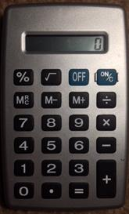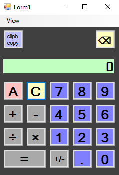

Figure 1. Pocket digital calculator and application GUI

As a starting point, observations of physical digital calculator (Figure
1.)were made. At this point decision was taken to change the display
content only on input of a new number, after functional button
(+,-,**×**,**÷)** stored previously entered input in memory register.
(Izzo, 2007). Following additional observations were made:

  - > Digital calculators allow to perform calculations consecutively,
    > without the use of Equal sign button, displaying result of
    > calculations and treating as a first operand in following
    > operations.

  - > Division by zero results in Error being displayed. Error State can
    > be reset only by pressing “C” button.

  - > If no second operand was provided, it is assumed that it is
    > identical as first operand.

  - > Each subsequent Equal button press results then in repeating
    > calculation with previous result as first operand, while second
    > operand and operation type stay unchanged.

  - > Entering a number between subsequent presses of Equal sign results
    > in first operand being replaced by new input.

  - > User action feedback is provided by short blink of LCD Display.

**Illustrating Variable changes for Educative purposes**

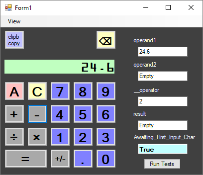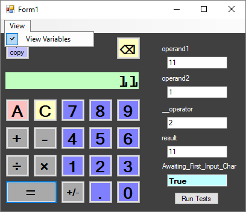

Figure 2.Calculator Application GUI with Variables View On.

This objective is not the part of calculator functionality or Assignment
requirements; however, acquiring the desired illustrative behaviour
helped me in understanding part of object oriented programming basics
and develop my knowledge. It helped in debugging and understanding the
internal workings of calculator as well. Calculator can serve as tool
for educational illustrative purposes. Insufficient knowledge about
language lead to minor issues, interface being non-uniform with Doubles
and incomplete decoupling from method I devised. Researching the
language documentation around the topic of overloading the assignment
operator or creating custom types did not led to any results applicable
in this situation. In consequence this approach remained
non-transparent. It does not affect the logic flow of an application;
however, the way of accessing the variables in the application have been
changed. Instead of assigning the value to a Vregister class directly,
it is needed to access its member – public Data property.

Operand1 = Convert.ToDouble(Display.Text)

Replaced by

Operand1.Data = Convert.ToDouble(Display.Text)

Possibility to display the values of variables was achieved by declaring
Vregister Class, that accepts textbox as an argument during the
instantiation(Figure3). Data property interface has been declared with
Set Subroutine, which updates the contents of a textbox and changes the
private member PrivateValue accordingly. Implemented methods and
properties include:

  - > IsEmpty - Boolean indicating whether Data property holds a value

  - > Empty() – Sets value to 0 and displays “Empty” in corresponding
    > textbox.

**IsEmpty** property Allows to replace **variable = Nothing**
expressions in flow control and displays content in a more approachable
way (Empty). Memory view is optional and can be toggled on or off in
tool strip menu under the View menu option(Figure 1). “Run Tests” runs a
quick series of regression tests, which facilitated the development, and
helped to focus on clearly stated tasks.

(The code in figure 3 below has been documented with XML tags, that has
been folded while executing print screen)

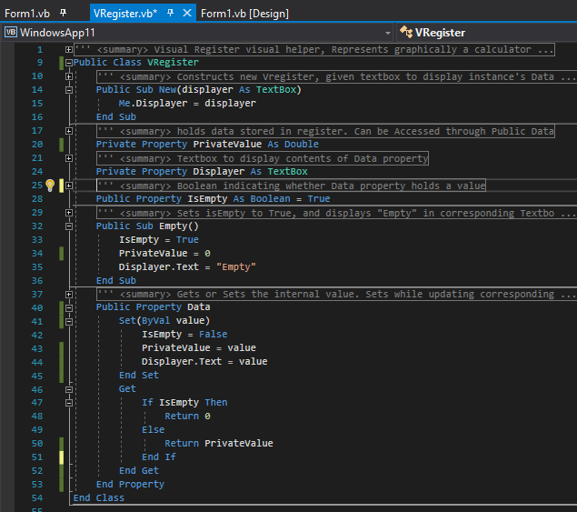

Figure 3. Source Code for Vregister class

**Application Logical Flow and Source Code**

While drawing up flowcharts for control flow of a calculator, decision
has been made to put focus on logical flow, as source code print screens
will be provided. The attempt has been made to represent complete
logical flow of calculator application, while abstracting from details
in cases where these are not relevant part of logic. For instance
conversion while reading the display content in Read() function, or
factored out logical flow of AddToDisplay() function. Mentioned
functions will be addressed and explained at the end of this section.
Some steps as visual LCD blinking effect providing user feedback, or
mentioned above Vregister implementation details, have been removed to
improve readability. Flowchart design follows Perry’s (no date) lesson,
and uses pointed display symbol for representing output action.
Considering granularity of logical branches in click handlers and usage
of declared functions in calculator application, the division of
flowchart and usage of off-page connectors is required. More complex
handlers or factored out functions will be presented and explained on
separate pages. Approach adopted in this part is to start with legend of
uncommon symbols and general overview, followed by logical flow of each
element, source code, and short explanation.

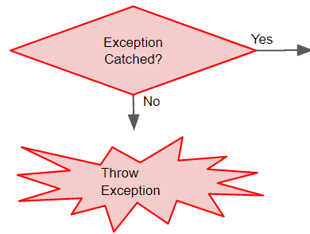UNCOMMON SYMBOLS:

  - Red borders signify try-catch control flow. Since no complex
    exception handling is present it is represented as part of logical
    flow.

  - Exception Thrown resulting in returning from procedure.

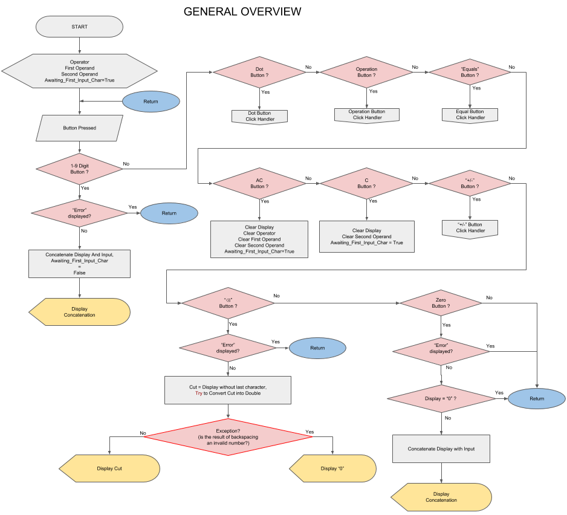

Figure 4.General overview

At the start of an application set of variables is declared, from which
four are substantial for application logic(Figure 5- source code)

1.  > **operand1** - VRegister storing Double representing First Operand

2.  > **operand2** - VRegister storing Double representing Second
    > Operand

3.  > **\_\_operator** - VRegister storing integer representing type of
    > operation (+-\*/)

4.  > **result** - VRegister storing Double representing the result
    > (this allows to implement repeated = presses calculation ) ,
    > secondary function is differentiation between calculation
    > performed by pressing "=" button and calculation performed by
    > functional buttons in consecutive series of operands ( 1 + 2 – 3
    > \* 4)

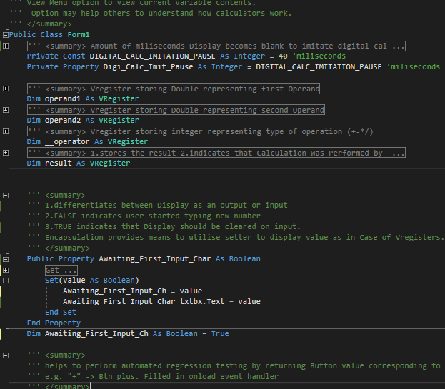

Figure 5. Preparation Step Source Code

After initialisation program awaits for user input (Figure 4), performed
by clicking desired button. This has been represented as series of
decision symbols, dispatching the task to correct click event handler.

In case of digit buttons 1-9 the control flow is straightforward (Figure
4), appending the value of button text property to display contents,
exploiting **sender** argument mechanism effectively. There’s need for
only one handler for all 1-9 buttons as presented on figure 6:

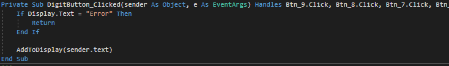

Figure 6. 1-9 digit buttons click event Handler

Following advocated by Gorla et al.(1990) descriptive approach to
variable names, I renamed texboxes along with other variables to
indicate purpose behind them. Display is the name of the textbox serving

as a calculator’s display. As per behaviour of digital calculator,
prevention of any user action is in force until error will be cancelled.
It prevents as well multiple edge cases in which Conversion Exception
could stop program execution. **AddToDisplay()** Function will be
explained in further detail later, the only important factor is its
switching **Awaiting\_First\_Input\_Char** to **False**, as presented on
the flowchart (figure 4.). Since imitation of digital calculator
requires to leave number entered on the screen this Boolean value
provides indication that input has been given.

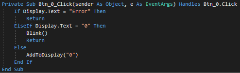

Figure 7.Click event handler for Button Zero.

The Zero button click event Handler, included on the first flowchart
page is separated from the other digits considering its special meaning
and onscreen behaviour. The check for current value of display is
performed to prevent unnecessary leading zeroes. **Blink()** function
serves as a user action feedback, a non-disputable key HCI element in
GUI design (Renaud & Cooper, 2000) . The effect is achieved by

Changing the text colour for 40 milliseconds on the colour of the
display background.

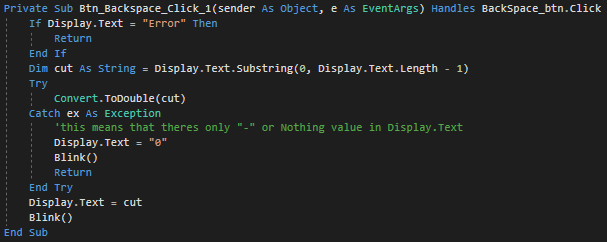

Figure 8. Backspace Button Click Event Handler.

The Backspace Button incorporates Exception Handling As mechanism to
check whether substring of Display Index from start index to character
index of second to last is still a string that can be converted to
Number. Substring operation may result in VB Null construct - Nothing
type, or “-“ with negative numbers at considerations. When this happens
, the digit zero is displayed , in consistence with digital calculators
behaviour. Otherwise **Display.Text** Value is replaced with cut string
representing valid Double number.

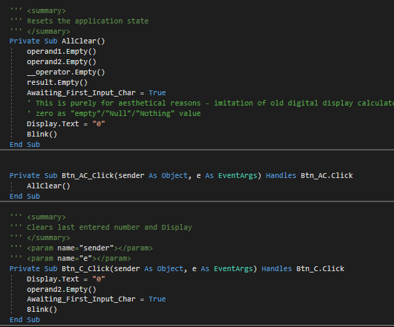

Figure 9. AC, C, and AllClear() Subroutines

“AC” button simply resets the state of application, clearing all key
variables (Figure 4), and displaying zero. **AllClear()** is factored
out for use in other functions, for instance regression tests. “C”
button removes the last entered second operand and/or Error without
completely resetting the state, allowing to continue calculations after
a mistakenly typed number, as if it never happened. This concludes the
Figure 4 flowchart.

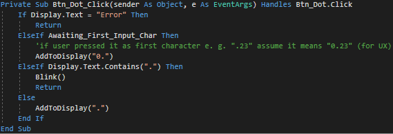

Figure 10. Decimal Point Click Handler Source Code

First off-page connector points to the Decimal Point or conveniently
shorter(taking into account the restrictive sizes of flowchart shapes)
the Dot Button Handler which prevents user from inserting two decimal
points(Figure 11) For consistency with digital calculator imitation and
user experience, if Point is first entered character it is displayed as
“0.”

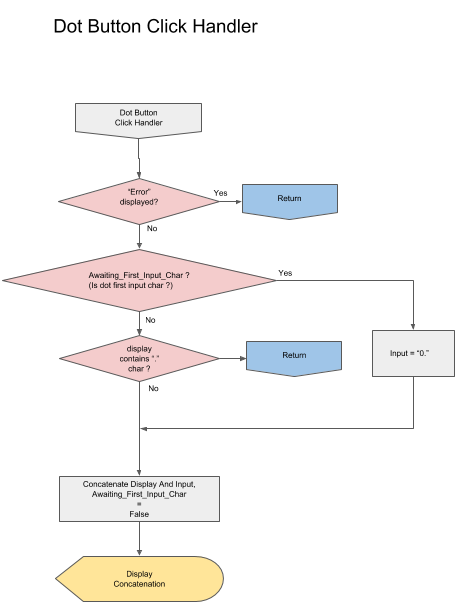

Figure 11. Decimal Point Click Event Handler Flowchart

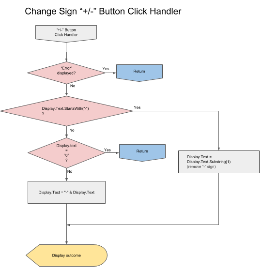

Figure 12.Change Sign Click Event Button Handler Flowchart

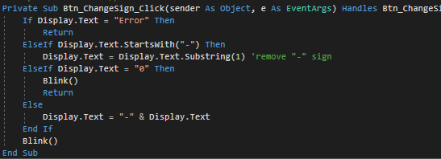

Figure 13.Change Sign Button Click Event Handler SourceCode

By checking first character with **String.StartsWith()** it is possible
to check number negativity without conversion to Double, thus
effectively only string operations are performed. Substring with start
index parameter 1 returns string without first character. If zero is
being displayed no changes are made, this exhausts all options but
string representing a positive number.

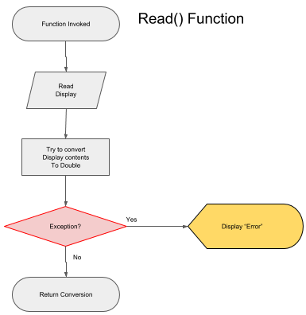

Figure 14. Read() Function

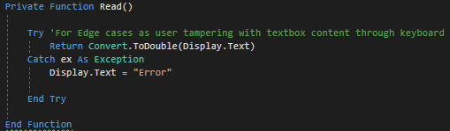

Figure 15.Read() Function Source Code

Function **Read()** will be used extensively in subsequent subroutines,
as it provides the validation and conversion bridge between
**Display.Text** value and Double Type used in core functionality of a
calculator.

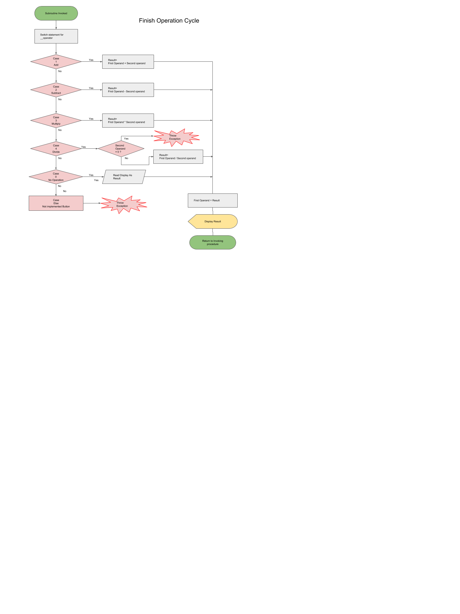

Figure 16.Finish\_Operation\_Cycle Subroutine Flowchart

This function is invoked by both Functional Button Handler and Equal
Button Handler, encapsulating common tasks and being key element of
application’s cyclical architecture. Based on value of **\_\_operator,**
case select switch decides which operation to perform on stored in
memory operands. The integer stored in **\_\_operator** is assigned on
functional button click event handler, and represents the type of
mathematical operation. It is remarkable that division by zero in Visual
Basic results in Infinity, thus to achieve consistency with mathematical
concept of division by zero (Weisstein, no date) , the need for
utilisation of Throw Exception command arises(Figures 16 & 17). When
operation to be performed is division, the value of second operand is
checked, and exception thrown appropriately. Branch of “Not Implemented
button” is not reached in complete application. Subroutine finishes
displaying the result and assigning it to first operand, to achieve
ability to perform consecutive calculations without pressing equal
button, as per digital calculator behaviour.

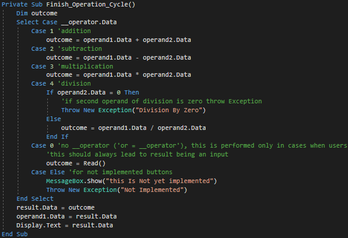

Figure 17.Finish\_Operation\_Cycle Subroutine Source Code

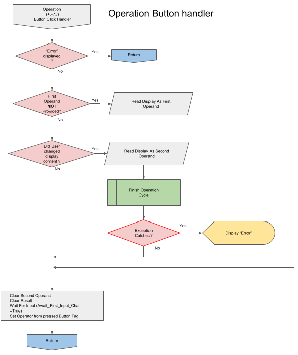

Figure 18. Operational Buttons Handler Flowchart

This subroutine handles all functional buttons, that change the
operation mode. Using **sender** argument passed we may refer to button
being pressed. The first logical branch which is worth remark is
checking for value being stored in first operand variable.
**operand1.isEmpty** member returns true only at initial state or after
pressing AC button. This branch is equivalent to one presented in the
classroom, reading the display.text as first operand using **Read()**
function(Figure19). The second branch catches the situation in which
user provided both operands and pressed functional button again, thus
seemingly allowing for operations on more than two numbers. However ,
results are shifted to first operand , hence theoretically operation has
only two operands. If custom division by zero exception is thrown, catch
statement handles it by displaying “Error”.

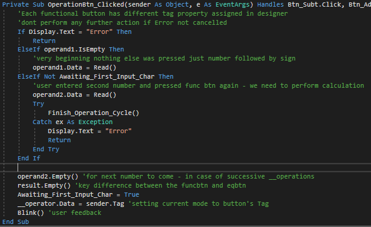

Figure 19. Operational Buttons Handler Source Code

If – Else block lets one usage case to slip through. When user presses
the different functional button immediately following previous
functional button (as if button was pressed by mistake e.g. sequence
“3+-+/” ), without providing new operand, only operation is changed -
as per observations of digital calculator behaviour.

Finally second operand is cleared for next inputs to come, and
Awaiting\_First\_Input\_char set to True. Operation mode is set to
corresponding **Button.Tag** property, assigned in designer , and
accessed by referring to sender argument object.

Two operand approach does not allow for implementing mathematical
operation order, arrays for operator and operands would be suitable and
recommended in this case.

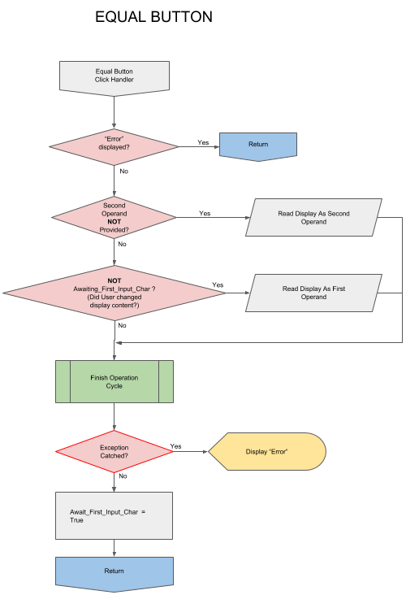

Figure 20.Equal Button Click Event Handler Flowchart

Final click event handler that concludes required functionality minimum
is invoked by pressing The Equality sign Button. If user presses it
immediately after choosing an operation, it is being assumed that second
operand is identical to first. Second branch is decisive in cases where
repeated clicks of button are interrupted by entering a new input
number, replacing current first operand with input. Both solutions
implemented accordingly to observations of digital calculator. Avoiding
interference with functional button performing operation by not clearing
the result variable. This allows to keep second operand in case of equal
button or performing consecutive operation in case of functional
buttons.

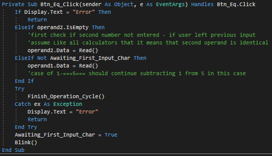

Figure 21.Equal Button Click Event Handler Source Code

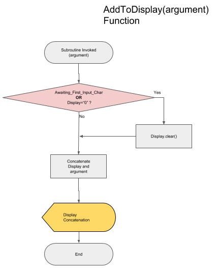

Figure 22. AddToDisplay() Function flowchart

This subroutine’s functionality narrows down to keeping the display
behaviour similar to that of calculators LCD display, not allowing for
complete clearing. As it is used only through user pressing input
buttons (0-9 digits and decimal point) it changes status of
**Awaiting\_First\_Input\_Char** to False.

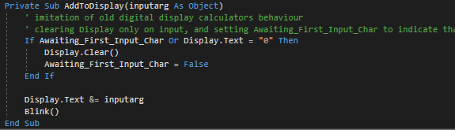

Figure 23. AddToDisplay() Function source code

Following source codes are out of scope of question 1 assignment
requirements; however it seems applicable to show an evidence of array
and list data type implementation. and in case of regression test it
serves as indication that efforts have been made to provide full
functionality and documentation of meeting all assignment requirements,
considering complexity level of application. Concluding , the answer on
second question of the assignment will refer to calculator

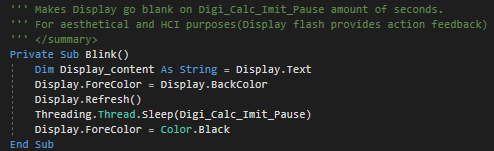

Figure 24.User Action Feedback - Blink() function

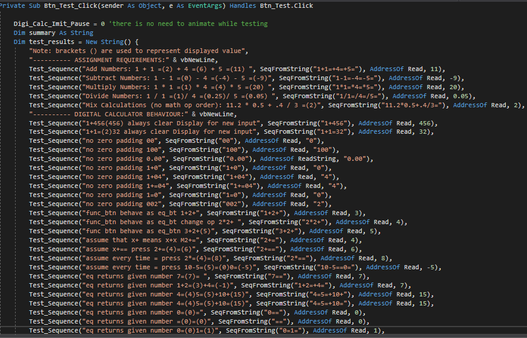

Figure 25.Regression Test List - part 1

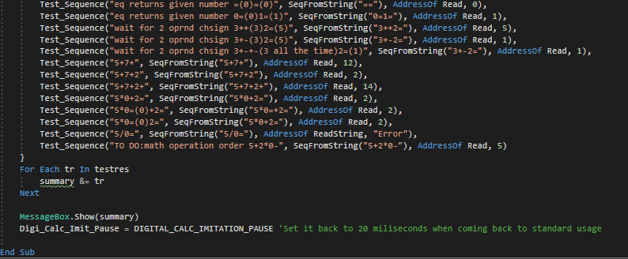

Figure 26.Regression tests List – part 2

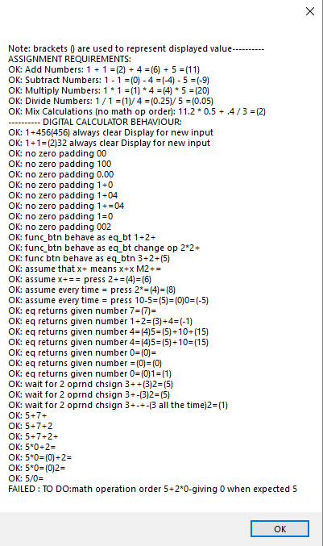

Figure 27.Regression Tests Output.

**ARRAYS**

Arrays are among the oldest and possibly the most used concepts in
programming. (Kiekintveld, 2010) Their structure stems from and mirrors
computer memory architecture, and provides intuitive way of applying one
procedure to multiple values with only few lines of code.

There is a necessity to distinguish between array as a data type, and
data structure. Data structures refer to systematic way of storing Data
in memory. As such, Array is a chain of consecutive memory adresses
referred by its foundation address or base address, that is address of
first element of the array. Any of Its members can be accessed at run
time (Elder, 2017) . This is possible due to its homogeneity, that is,
uniform data type across given array. Given this rule memory address of
an element is calculated from foundation address incremented by product
of member index and size of storage space required by member.
Kanagavalli & Maheeja (2016) classify Arrays as storage data structures,
as opposed to process-oriented data structures (i.e. linked lists), or
descriptive data structures (e.g. binary trees, collections). This is
due to the narrow nature of retrieval process, which, while being
efficient in index based searches, does not compares with hashing based
indexing useful in search-match algorithms.

Array as Data Type may be implemented in some languages with Array Data
Structure while in others array implementation may be based on linked
lists, or hash tables, and most often are objects with methods expanding
their abilities. Arrays are often described as dimensionally-fixed,
meaning the once allocated memory size cannot be changed, however it is
not always the case.

In Visual Basic there are few ways to declare an Array and to re-declare
it:

Dim StudentNames(16) As String ‘declares one-dimensional Array of
strings

ReDim TwoDimensionalArray (20,20) As Integer ‘re-declares
two-dimensional Array of Integers

Regression tests in calculator application employs arrays and its
convenient loop accessing. At first **test\_results** array is declared
it with setting its members to strings returned by **test\_sequence**
function:

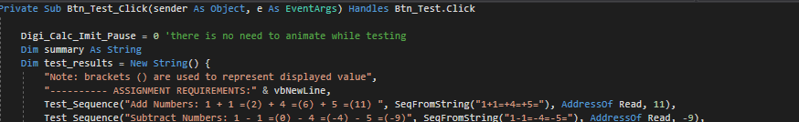

Figure 28.Series of regression tests implemented with use of String
arrays (fragment of figure 25)

This method of declaring an array facilitates development since there is
no need to specify number of elements in advance. We can add another
required test, changing only one line of code.

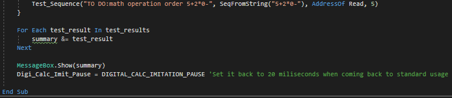

Figure 29.Accessing elements of an array in for each loop. (fragment of
figure 26)

For Each loop in Visual Basic provides practical abstraction from
knowledge about current number of elements that array holds being
cleaner and more elegant in cases when index is not relevant. In this
particular instance there is only a need for concatenating all results
into summary.

For Each is equivalent to following loop:

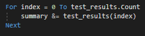

Figure 30.Accessing elements of an array in for-to loop

Since Visual basic strings are form of an Array (array of characters)
the **SeqFromString()** function employs shared interface feature For
Each Loop as well:

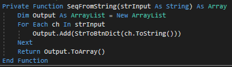

Figure 31.SeqFromString() - looping through string as array of Chars

This example illustrates underlying nature of String data type, being an
Array of strings. The returned value is array of Button references we
can loop through in **Test\_Sequence()** function simulating user
pressing programmed sequence of buttons. We can observe other functional
descendants inheriting Array structure and extending its interface.
ArrayList data Type provides additional methods. **Add()** allows
extending the ArrayList during execution-time, further abstracting from
initial requirements and restrictions of Arrays. **ArrayList.ToArray()**
method returns an array copy of parent instance. **StrToBtnDict**
dictionary is good example of case where arrays are not efficient.
Dictionaries Allow to use keys instead of indexes, making them much
powerful tool when mapping non-numerical values. Concluding, Arrays are
most fundamental and convenient tool for programmers, not applicable in
every case.

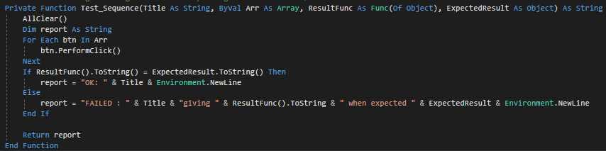

Figure 32.Test sequence() function looping through sequence of buttons
and comparing the outcome with desired result.

Elder, J. (2017) Lecture 3: Linear Data Structures. \[PowerPoint
presentation for CSE\]. 12-01-17. York University. Available
At:https://www.eecs.yorku.ca/course\_archive/2011-12/W/2011/lectures/03%20Linear%20Data%20Structures.pdf
(Accessed 11/03/18)

Gorla, N., Benander, A.C., Benander B.A.(1990) Debugging effort
estimation using software metrics. *IEEE Transactions on Software
Engineering.* 16(2) pp.223-231 Available At:
http://ieeexplore.ieee.org/document/44385/ (Accessed 1/3/18)

Izzo D.(2007) *How Calculators Work.* \[Youtube\] Available At:
<https://www.youtube.com/watch?v=IyXRiZcIZbw> (Accessed: 15/02/18)

Kanagavalli, V. R., Maheeja, G. (2016) *A Study on The Usage of Data
Structures in Information Retrieval.* Available At:
https://arxiv.org/ftp/arxiv/papers/1602/1602.07799.pdf (Accessed:8/3/180

Microsoft(no date)
https://docs.microsoft.com/en-us/dotnet/visual-basic/programming-guide/language-features/arrays/

Perry A. (no date) *Flowchart Symbols in Programming: Definition,
Functions & Examples.* Available At:
<https://study.com/academy/lesson/flowchart-symbols-in-programming-definition-functions-examples.html>
(Accessed: 24/02/18)

Renaud, K., Cooper R.(2000*) Feedback in human-computer interaction -
characteristics and recommendations.* Available At:
https://www.researchgate.net/publication/220102904 (Accessed: 10/3/18)

Weisstein, E. W. (no date) *Division by Zero*. Available At:
<http://mathworld.wolfram.com/DivisionbyZero.html> (Accessed: 01/03/18)
